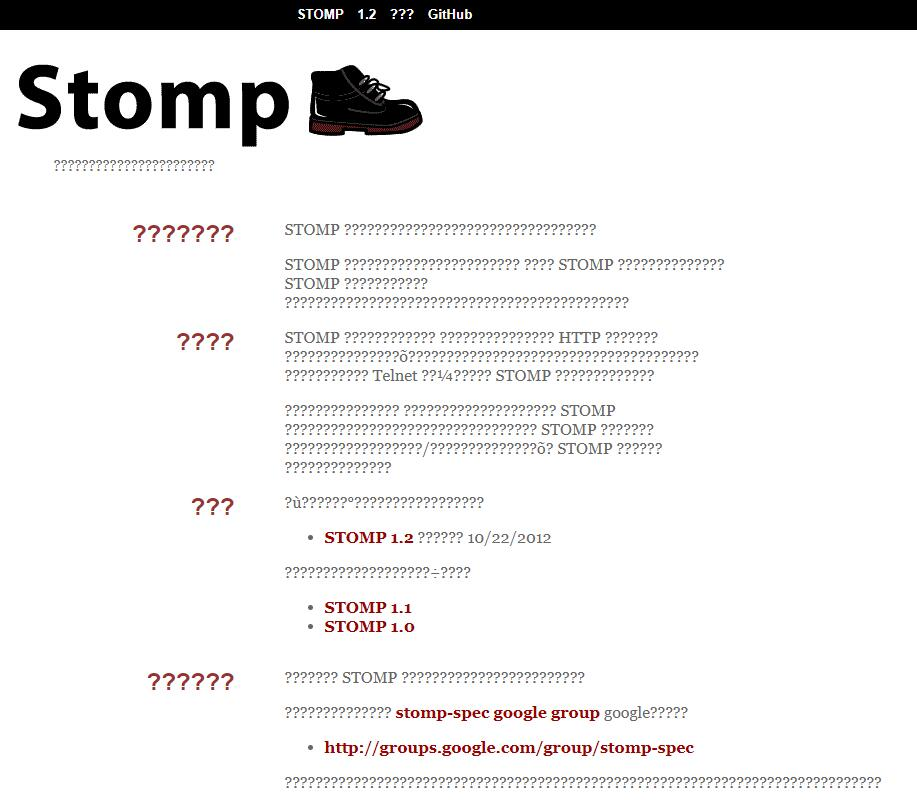

概述
--------

~~该静态网站是使用 [Scalate](https://scalate.github.io/scalate/) 生成的。~~

该静态网站 Fork 自 [stomp/stomp.github.com](https://github.com/stomp/stomp.github.com)；
我曾经尝试使用 master 分支上的代码生成该静态页，但：

我居然在这个问题上耗费了几个小时……

源代码仓库为：[stomp-spec](http://github.com/stomp/stomp-spec/)

问题与拉取请求应在 [此处](http://github.com/stomp/stomp-spec/) 提交。
